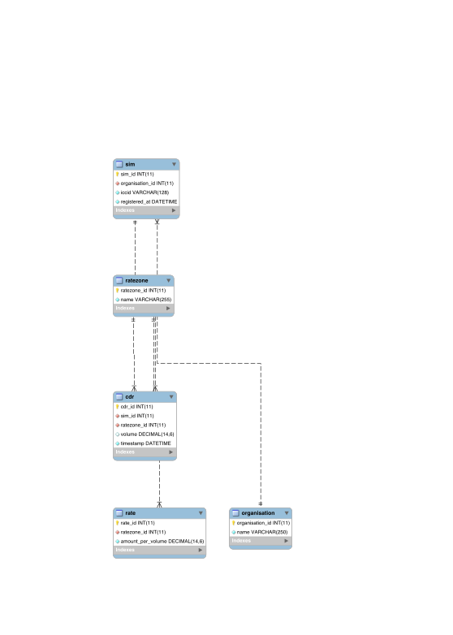

# Billing API Pay As You Go / Inclusive Volume

Write billing API.
Two pricing models: Pay-As-You-Go, Inclusive Volume
Pricing model per organisation.
Inclusive-Volume: Each SIM has a minimum commitment
Task for candidate: Please provide list of all shortcomings + ideas for future improvements (inline comments)!

# To Start:
- install docker, postman
- docker-compose up
- look an http://localhost:3000/ with Postman

# Quests take as much as you like:
- change port served to 8000
- create an endpoint which gives you the bill for a specific organisation
- implement an approach do different currency's
- provide an approach to implement to Inclusive volume (each Org has an inclusive volume when it exceeds it is charged as before)

